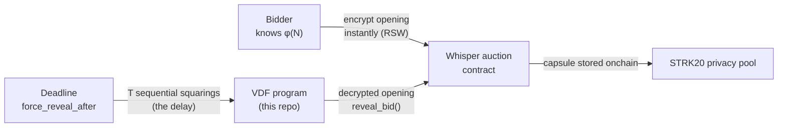

# VDF

VDF is a **Verifiable Delay Function** + **timelock decryption** implementation for
Starknet, written as a provable Cairo executable. It answers one question:

> What causes decryption capability to become available at a deadline, with **no
> standing decryptor, no committee, and no TEE**?

The answer: the encryptor (who knows the RSA factors) derives the key instantly,
but everyone else must perform **T sequential squarings** — a delay that cannot
be parallelized. A short Wesolowski proof lets a verifier check the squarings
happened in O(log T) group operations.

## What this enables



- **Sealed-bid auctions**: bids stay hidden until reveal; even the auctioneer
  learns amounts only at the deadline.
- **eBay-like UX preserved**: bidders bid once and walk away; anyone can
  force-reveal at the deadline.
- **Provable**: the reveal computation can be proven with Stwo and verified
  onchain via the Cairo recursive verifier — a Starknet tx never runs the
  ~billion-step computation, it verifies a small proof.

## Repository layout

```
cairo/
  lib/   # bigint + Wesolowski verifier (u64 limbs, u256 accumulation, Barrett)
  exec/  # #[executable] vdf_verify entrypoint, depends on lib
ref/     # Python reference implementation + exact Cairo-algorithm model
vectors/ # test vectors (RSW keys + Wesolowski proofs)
scripts/ # generators: vectors, Cairo tests, executable args
skill/   # the Hermes skill for this work (SKILL.md + references + scripts)
```

## Status

- [x] Python reference + vectors (RSW + Wesolowski)
- [x] Cairo verifier (`lib`) + `#[executable]` entrypoint (`exec`)
- [x] `scarb execute` → output `1` on 256/512/1024-bit vectors
- [x] `scarb execute --output=standard` → prover input
- [ ] `scarb prove` (verified working on the pipeline; needs 16GB+ machine)
- [ ] Onchain recursive-verifier integration
